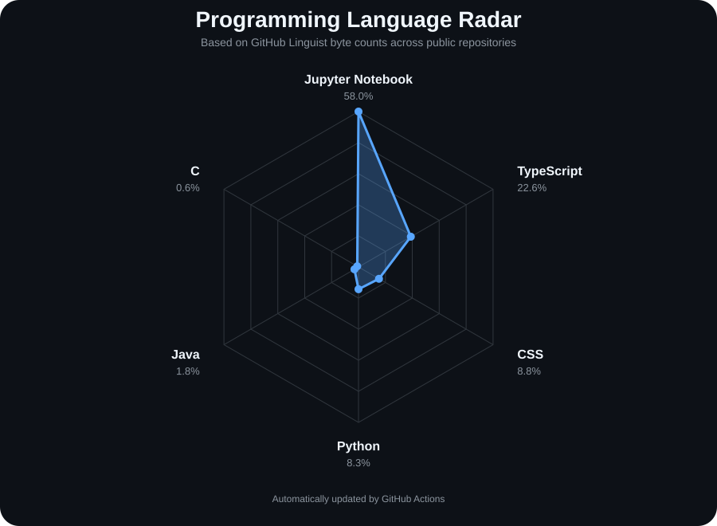

<h1 align="center">Hi 👋, I'm Shubham Bilgi</h1>

<h3 align="center">
Software Developer • Cybersecurity Enthusiast • IT Graduate
</h3>

  
  
  

---

## 👨‍💻 About Me

I'm an IT graduate focused on **building practical software and learning how to secure it**.

- 💻 Software Development
- 🌐 Web & Application Development
- 🔐 Cybersecurity & Web Security
- 🐍 Python
- ⚛️ React & TypeScript
- 🗄️ SQL & Databases
- 📊 Data & Analytics

I learn by building projects, working with real technologies, and improving through hands-on problem solving.

---

## 🕸️ Programming Language Radar

  

> The radar is generated from **GitHub Linguist language byte counts** across my public repositories and is automatically refreshed with GitHub Actions.

---

## 🌐 Software & Web Development

  

- React & TypeScript
- JavaScript
- HTML & CSS
- Node.js
- REST APIs
- Authentication workflows
- React Native
- Android Studio

---

## 🗄️ Databases

  

- MySQL
- PostgreSQL
- SQL
- Backend API integration

---

## 🔐 Cybersecurity

  

  
  
  

- Web application security
- Vulnerability assessment
- Penetration testing fundamentals
- OWASP Top 10
- Burp Suite
- Nmap
- Wireshark
- Kali Linux

---

## 🛠️ Development Tools

  

- Git & GitHub
- Visual Studio Code
- Android Studio
- Git-based development workflows

---

## 💼 Experience

### Web Developer Intern
**EngageSphere Technology Pvt. Ltd. — Pune**  
**Jan 2026 – Mar 2026**

- Developed mobile application interfaces using React and TypeScript.
- Worked on multiple client projects.
- Implemented authentication workflows.
- Integrated frontend applications with backend APIs and MySQL.
- Worked with Android Studio and React Native.

### Data Analyst Intern
**SORT Solutions — Pune**  
**Mar 2025 – Jun 2025**

- Performed market research and data analysis.
- Created dashboards using Power BI.
- Worked with Excel and data visualization.
- Collaborated with team members on analytical tasks.

### Cyber Security Intern
**SpringUp Labs — Pune**  
**Apr 2025 – Jul 2025**

- Performed vulnerability assessment and penetration testing activities.
- Worked with web application security concepts.
- Used tools such as Burp Suite, Nmap and Wireshark.
- Studied OWASP Top 10 and common web vulnerabilities.

---

## 🎓 Education

**Bachelor of Engineering — Information Technology**  
Sinhgad College of Engineering / SPPU  
**2022 – 2026**

---

## 📜 Certifications

- Ethical Hacker — Cisco
- Introduction to Cybersecurity — Cisco
- Foundations of Cybersecurity — Google
- C++ Programming — IIT Bombay
- Certified Penetration Testing Specialist — Hack & Fix

---

## 📊 GitHub Activity

  

  

---

  <i>Building software. Learning security. Solving problems.</i>

